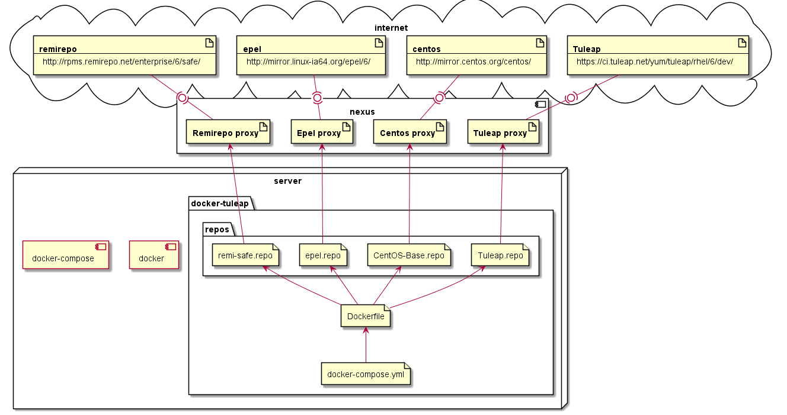
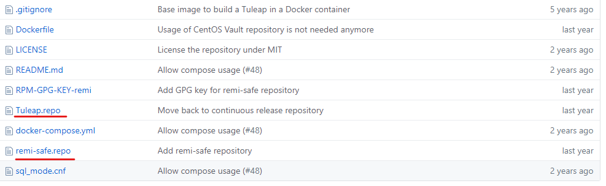
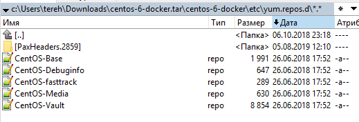

# Установка tuleap в закрытой сети с использованием docker

Для установки tuleap в закрытой сети с использованием докер, необходимо подготовить все зависимости, а также docker images.


Детали могут отличаться, но суть одна.

## Схема

Общая идея продемонстрирована на схеме ниже.



Дальше берем nexus и docker-tuleap и переносим куда нужно уже без интернета.

 

## Менеджер репозиториев

Необходим для кэширования зависимостей. 

https://www.sonatype.com/nexus-repository-oss

https://help.sonatype.com/repomanager3/installation/installation-methods

Качаем архив и запускаем. `nexus.exe /run`

http://localhost:8081/

Пароль от администратора в файле `admin.password` внутри `$data-dir`:

https://help.sonatype.com/repomanager3/installation/accessing-the-user-interface

### Настройка 

* Создаем blobstores: **yum**
* Создаем proxy yum repository (`Repositories > Create repository > yum (proxy)`):
  * **Tuleap**
    * <u>name</u>: Tuleap
    * <u>remote storage</u>: https://ci.tuleap.net/yum/tuleap/rhel/6/dev/
    * <u>blob store</u>: yum
  * **Centos**
    * <u>name</u>: centos
    * <u>remote storage</u>: http://mirror.centos.org/centos/
    * <u>blob store</u>: yum
  * **Epel-Tuleap**
    * <u>name</u>: epel-tuleap
    * <u>remote storage</u>: http://mirror.linux-ia64.org/epel/6/
    * <u>blob store</u>: yum
  * **Remirepo**
    * <u>name</u>: remirepo
    * <u>remote storage</u>: http://rpms.remirepo.net/enterprise/6/safe/
    * <u>blob store</u>: yum

## Docker

За основу сборки взять официальный репозиторий tuleap для docker:

https://github.com/Enalean/docker-tuleap-aio

Правим файл Dockerfile заменяя все конфиги репозиториев в `/etc/yum.repos.d/`

Чтобы понять какие файлы находятся в данной папке можно добавить `RUN ls /etc/yum.repos.d` в Dockerfile, что выведет список всех файлов с конфигурацией.

***Все файлы должны быть заменены!***

### Конфиги репозиториев

#### tuleap

https://github.com/Enalean/docker-tuleap-aio

Настраиваем Tuleap и remi.



#### centos

https://github.com/CentOS/sig-cloud-instance-images/tree/23b05f6a35520ebf338e4df918e4952830da068b/docker

Качаем архив, распаковываем и идем смотреть, какие репы нужно перенести



Настраиваем CentOS-Base. Остальные делаем пустыми.

#### **centos-release-scl**

https://github.com/sclorg/centos-release-scl/tree/master/centos-release-scl

Прилетает при установке [centos-release-scl](https://github.com/Enalean/docker-tuleap-aio/blob/master/Dockerfile#L11)

Настраиваем `CentOS-SCLo.repo`

С помощью `RUN ls /etc/yum.repos.d`  узнал, что прилетают так-же `CentOS-SCLo-scl.repo` и `CentOS-SCLo-scl-rh.repo`. Создаем пустые файлики.

#### epel-release

https://github.com/dayne/yum/blob/master/centos6/epel.repo

Прилетает при установке [epel-release](https://github.com/Enalean/docker-tuleap-aio/blob/master/Dockerfile#L10)

Настраиваем `epel.repo`

Создаем пустой `epel-testing.repo`

### Перенос images

Для сборки конечного изображения понадобятся два images:

* centos (tag 6)
* mysql (tag 5.6)

#### save

```bash
$> docker save centos > centos.tar
$> docker save mysql > mysql.tar
```

#### load 

```bash
$> docker load -i centos.tar
$> docker load -i mysql.tar
```


## Запуск сборки

Сначала собираем на машине с интернетом, потом берем nexus и файлы docker  и переносим на машину без интернета. Для сборки используем docker-compose.

```bash
$> docker-compose up
```


## Настройка после запуска контейнера

Не уверен, но крайне не рекомендуется делать `chmod 777 -R data` в рабочем каталоге. Ломает gitolite. 

### Доступ к сертификатам

https://github.com/Enalean/docker-tuleap-aio/issues/59

В файле `data/tuleap-data/etc/nginx/conf.d/tuleap.conf`

Изменить 

```
ssl_certificate /etc/pki/tls/certs/localhost.cert.pem;
ssl_certificate_key /etc/pki/tls/private/localhost.key.pem;
```

На

```
ssl_certificate /etc/pki/tls/certs/localhost.crt;
ssl_certificate_key /etc/pki/tls/private/localhost.key;
```

### Основные настройки

Основные конфигурационные параметры расположены в файле `data/tuleap-data/etc/tuleap/conf/local.inc`

Для настроек почты не должно использоваться IP адресов. Только домены. Иначе будут ошибки при создании треков и прочих объектов с нотификацией. 
Особое внимание уделить настройке `$sys_default_mail_domain`

### Настройка портов

Порты объявленные в **docker-compose.yml** должны быть настроены в `local.inc`

**docker-compose.yml**

```yaml
...
services:
 app:
  build: ./
  restart: unless-stopped
  ports:
   - 8585:80
   - 4443:443
...
```

**local.inc**

```ini
$sys_default_domain = '<your_host_or_id>:8585'
$sys_https_host = '<your_host_or_id>:4443'
```

### Пароль администратора

```
$> /data/root/.tuleap_passwd
```

### Отключение ssl

https://github.com/Enalean/docker-tuleap-aio/issues/20#issuecomment-254517027

Если необходимо отключить ssl, то:

* в файле `local.inc` параметр `$sys_https_host` делаем пустым   

* настраиваем nginx (./data/tuleap_data/etc/nginx):

  * удаляем <u>./data/tuleap_data/etc/nginx/conf.d/default.conf</u> (лучше перенести в субкаталог **delete**)
  * правим <u>./data/tuleap_data/etc/nginx/conf.d/tuleap.conf</u>, удаляем 443 сервер, дорабатываем 80

  ```ini
  upstream tuleap-apache {
      server 127.0.0.1:8080;
  }
  
  upstream tuleap-php-fpm {
      server 127.0.0.1:9000;
  }
  
  upstream tuleap-php-fpm-long-running-request {
      server 127.0.0.1:9002;
  }
  
  #server {
  #        listen       443 ssl http2;
  #        server_name  1.0.0.137;
  #
  #        ssl_certificate /etc/pki/tls/certs/localhost.crt;
  #        ssl_certificate_key /etc/pki/tls/private/localhost.key;
  #        ssl_session_timeout 1d;
  #        ssl_session_cache shared:SSL:50m;
  #        ssl_session_tickets off;
  #
  #        # modern configuration. tweak to your needs.
  #        ssl_protocols TLSv1.2;
  #        ssl_ciphers 'ECDHE-ECDSA-AES256-GCM-SHA384:ECDHE-RSA-AES256-GCM-SHA384:ECDHE-ECDSA-CHACHA20-POLY1305:ECDHE-RSA-CHACHA20-POLY1305:ECDHE-ECDSA-AES128-GCM-SHA256:ECDHE-RSA-AES128-GCM-SHA256:ECDHE-ECDSA-AES256-SHA384:ECDHE-RSA-AES256-SHA384:ECDHE-ECDSA-AES128-SHA256:ECDHE-RSA-AES128-SHA256';
  #        ssl_prefer_server_ciphers on;
  #
  #        # Tweak for file upload and SVN
  #        client_max_body_size 256M;
  #
  #        include conf.d/tuleap.d/*.conf;
  #}
  
  server {
      listen       80;
      server_name  1.0.0.137;
  
      location /.well-known/ {
        root /opt/letsencrypt;
      }
  
      #location / {
      # return 301 https://$server_name:443$request_uri;
      #}
  
      client_max_body_size 256M;
  
      include conf.d/tuleap.d/*.conf;
  }
  ```

  

## Журналы ошибок

https://docs.tuleap.org/administration-guide/system-administration/logs.html

Для получения всех логов можно воспользоваться скриптом [get_all_logs.sh](docker-tuleap/get_all_logs.sh)

```bash
$> ./get_all_logs.sh dockertuleap_app_1
```

## Последовательность действий

1. Устанавливаем nexus
2. Настраиваем proxy репозитории
3. Клонируем репозиторий docker-tuleap-aio
4. Настраиваем файлы конфигурации репозиториев на nexus репозитории корректируя Dockerfile
5. Настраиваем docker-compose
6. Собираем image
7. Сохраняем производные images нужные для нашего image в файл (centos, mysql)
8. Копируем рабочий каталог nexus, и производные images, и файлы сборки docker (./docker-tuleap) на флэш накопитель 
9. Переносим все в закрытую сеть и настраиваем
10. Собираем image и запускаем контейнер